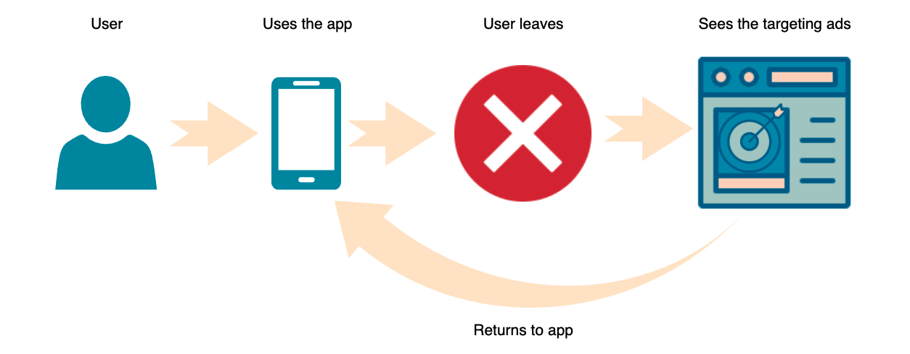

# Retargeting

Retargeting (also known as remarketing) is a type of advertising that targets already known users that at some point used your app and then stopped doing so. By targeting users who already downloaded your app and prompting them to get engaged again, you can ensure that usage remains steady. Retargeting is often done with special incentives like events, discounts or free in-app items.

## Deep Links

Mobile retargeting is based on deep links and there are two types: default and deferred deep links. A default deep link can only open currently installed apps. The deferred deep links are more complex. They can redirect the users to the Play Store/App Store if the user doesn’t have the app installed.

Deep links are set in the format **\[scheme]://\[host]/\[path]**, and all 3 fields are editable via the dashboard. Your app has to support deep linking and needs to be installed already on the users device for a deep link to work. Information on how to integrate the deep links can be found [here](https://developer.android.com/training/app-links/deep-linking) (Android) or [here](https://developer.apple.com/documentation/xcode/defining-a-custom-url-scheme-for-your-app) (iOS).

Deferred deep links are currently only supported on Android by justtrack. A deferred deep link also handles the case when your app is not (or no longer) installed on the device of the user. In this case, we redirect the user to the Play Store to download your app again. If the app is already installed a deferred deep link acts like a normal deep link.

On app open justtrack checks if the user is already attributed. If not, we will perform a normal attribution. If the user is already attributed, we check if the user was in contact with a retargeting campaign and then try to reattribute the user.

Retargeting campaigns are the only ones that can trigger the reattribution.

## Promo Codes

To make sure users will get the advertised incentives, each retargeting campaign can get one promo code assigned. Promo codes are alphanumeric strings and can be set up via the justtrack dashboard on the campaign. Once a user had contact with a retargeting campaign and opens the app, the promo code is available in the justtrack SDK. The app can access this information and react accordingly.

Why is retargeting useful?

* It helps remind users of your apps as they browse the web or use other apps,
* It can be tailored for different user groups,
* You are targeting the users for which you know that they showed interest in your app.
